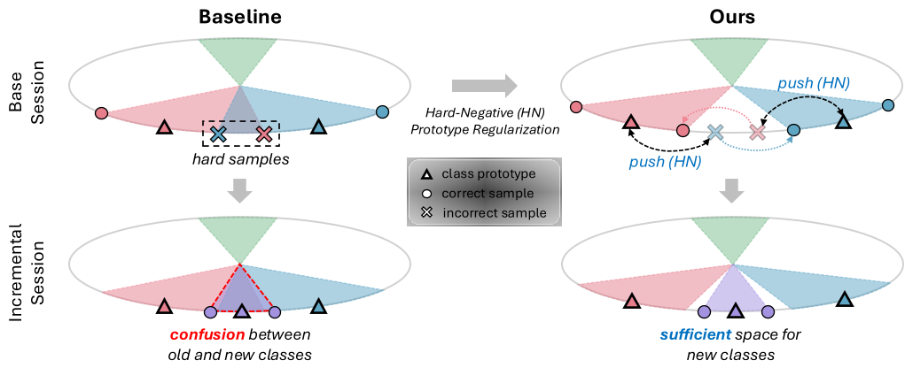

# Hard-Negative Prototype-Based Regularization for Few-Shot Class-Incremental Learning (TMLR 2025)

This is the official implementation of the paper **"Hard-Negative Prototype-Based Regularization for Few-Shot Class-Incremental Learning"**, accepted at **TMLR 2025**.

<p align="center">
    
</p>

## 🛠️ Environment Setup

To install the necessary dependencies, run the following command:

```bash
pip install -r requirements.txt
```

### Dependencies
* Python 3.8+
* PyTorch 1.12.1+
* torchvision 0.13.1+
* WandB (optional, for logging)

## 📋 Preliminary

### 1. Data Preparation
Our experiments are conducted on **CIFAR-100**, **CUB-200**, and **mini-ImageNet**. Please place the datasets in the `./data` directory or specify your custom path using the `--data_root` argument. For dataset preparation, you can refer to the instructions in the [CEC repository](https://github.com/icoz69/CEC-CVPR2021).

*   **CIFAR-100**: Automatically downloaded by default.
*   **CUB-200**: Download the dataset and place it under `./data/CUB_200_2011/`.
*   **mini-ImageNet**: Download the dataset and place it under `./data/mini-imagenet/`.

### 2. Similarity Matrices (Optional)
If you wish to use **Static Selection** of hard-negative prototypes (using `--use_static_topk`), you need to have the pre-calculated similarity files in:
`data/similarity/`.

## 🚀 Training & Evaluation

We provide shell scripts to reproduce the results for each dataset. These scripts will sequentially run the training on the base session and then evaluate on all incremental sessions.

### Reproducing Results

To run the experiments, use the following commands:

```bash
# CIFAR-100
bash script/train_cifar100.sh

# CUB-200
bash script/train_cub200.sh

# mini-ImageNet
bash script/train_mini.sh
```

### Logging
By default, the scripts are configured to use **Weights & Biases (WandB)** for logging. If you do not wish to use WandB, you can remove the `--wandb` flag from the shell scripts.

### 📊 Results
The results (accuracy per session, average accuracy, and performance drop) will be saved in:
* Local: `./log/{dataset}/{run_name}/result.txt`
* Global summary: `./log/{dataset}/exp_results.txt`

## 🤝 Acknowledgment
Our code is built upon the following repositories:
* [CEC (CVPR 2021)](https://github.com/icoz69/CEC-CVPR2021)
* [ALICE (ECCV 2022)](https://github.com/CanPeng123/FSCIL_ALICE)

We thank the authors for their excellent work and for making their code publicly available.

